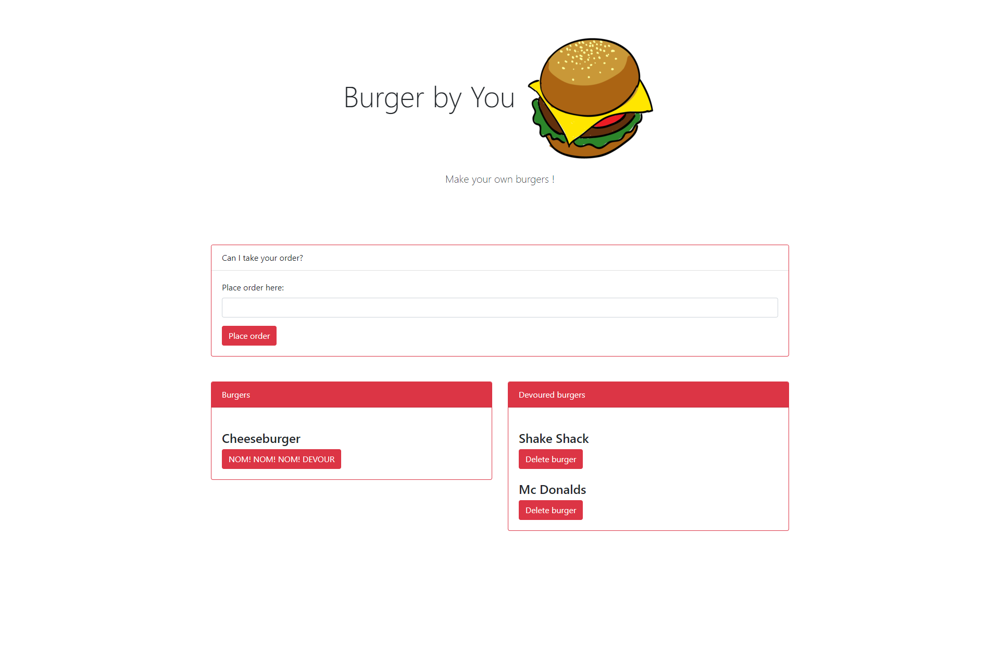

  # **Burgers by YOU**
 
  [VIEW DEMO](https://youtu.be/p1VWZCEkRGo)
  
  
  
  
  ## About this project 
  This is a full stack, Model View Controller application that allows the user to create a burger ``(POST)``, view a list of burgers ``(GET)``, devour the burgers ``(PUT)`` and delete them after they are done ``(DELETE)``.  
  
  ## Table of contents

  * [Description](#Description)

  * [Installation](#Installation)
  
  * [Usage](#Usage)

  * [License](#License)

  * [Contributors](#Contributors)

  * [Test](#Test)

  * [Questions](#Questions)
  
  
  
  ## license
  

  ## Installation
  
  1. Clone the repository
  2. Install Node.js
  3. Install the dependencies
  4. Install MySQL Workbench
  5. Set up a development database
  6. Create a .env file to store your MySQL Password
  7. Verify database connection information
  8. Start the server

  ## Usage
  Open the Application through the terminal using: -> npm run

  ## Contributing
      
  Oscar Chiriboga
  
  
  Link to GitHub: https://github.com/cracso

  ## Test
  -> npm run tests

  ## Questions
  
  Email address: oscarmchiriboga@gmail.com
  